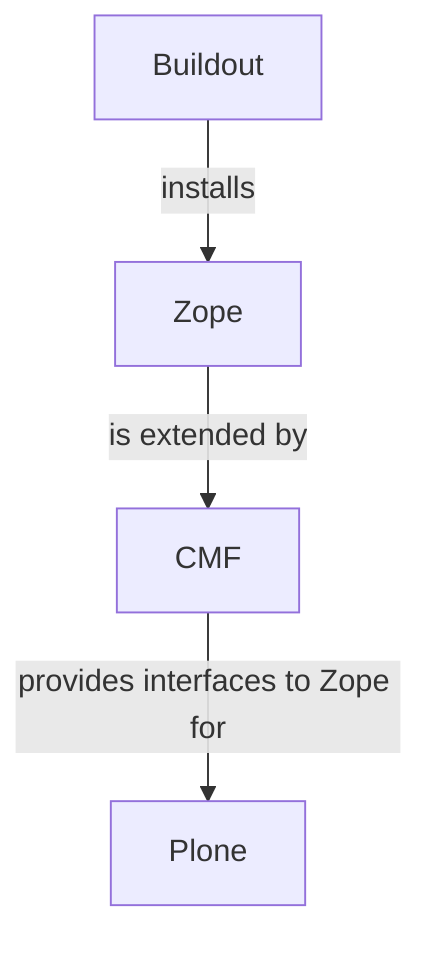

# Minimal Plone Buildout
A minimal Plone buildout for learning purposes.

- [How Does It Work](#how-does-it-work)
- [Setup Instructions](#setup-instructions)
  - [Requirements](#requirements)
    - [macOS](#macos)
  - [Environment Creation](#environment-creation)
    - [Quick](#quick)
    - [Explained:](#explained)
  - [Reset Environment](#reset-environment)
    - [Quick](#quick-1)
    - [Explained](#explained-1)
- [Using This Repo](#using-this-repo)
  - [Python Requirements File](#python-requirements-file)
  - [Management Scripts](#management-scripts)
  - [Buildout File](#buildout-file)


## How Does It Work
[Plone](https://plone.org/) is a content management system build on top of the [Zope Application Server](https://www.zope.dev/) via the [Zope Content Management Framework (CMF)](https://old.zope.dev/Products/CMF/index.html/). Both Plone and Zope are installed via [Buildout](http://www.buildout.org/en/latest/) -- a package manager and build system created specifically for Zope. The stack looks like this:

<center>



</center>


## Setup Instructions

### Requirements
- **Operating System:** macOS or some Linux-like environment.
- **Python Version:** 3.7.16 (available via [PyEnv](https://github.com/pyenv/pyenv))
- **Optimize Buildout (Optional)**: See [User Default Configuartion](http://www.buildout.org/en/latest/topics/variables-extending-and-substitutions.html#user-default-configuration-1)

#### macOS
Some additional libraries are needed on macOS for [Pillow](https://pillow.readthedocs.io/en/stable/). To get these additional libraries, [install Homebrew](https://brew.sh/) and run:

```
brew install zlib libjpeg
```

### Environment Creation

#### Quick
```
./scripts/reset.sh
```

#### Explained:
```
# Create a virtual environment
python3 -m venv env

# Activate the virtual environment
source env/bin/activate

# Update pip
pip install -U pip

# Install requirements
pip install -r requirements.txt

# Create the buildout
buildout -N -v
```

### Reset Environment

#### Quick
```
./scripts/reset.sh
```

#### Explained
```
# Delete the Buildout files
rm -r bin develop-eggs env include lib parts src var .installed.cfg .mr.developer.cfg pyvenv.cfg
```

Then re-run the commands to create the environment.

## Using This Repo
This repo comes with:
- A Python requirements file (`requirements.txt`)
- Management scripts (in `./scripts`)
- and a preconfigured Buildout file (`buildout.cfg`)

### Python Requirements File
The Python requirements file is just to prepare a virtual environment for Buildout. All other dependencies should be managed via Buildout.

### Management Scripts
There are management scripts provided for various routine actions:

| Script | Desc |
| - | - |
| `clean.sh` | Removes all file generated by Python venv and Buildout. |
| `create-venv.sh` | Created a Python venv with the default Python version. |
| `run-buildout.sh` | Runs Buildout in quick mode with verbose logging. |
| `reset.sh` | Runs `clean`, `create-venv` and `run-buildout` in that order. |

### Buildout File
Buildout is a package and environment manager built to maintain reproducible development environments given the same Python version and config file. The config file in this repo, `buildout.cfg` does the following:

- Loads the Plone 5.x configuartion files
- Loads the [mr.developer](https://github.com/fschulze/mr.developer) externsion for managing external packages
- Configures a minimal Plone 5.x part